# Integrating Esemoil Humidifier (2.5 L) with HomeAssistant and LocalTuya

A short guide on how to integrate an [Esemoil Humidifier (2.5 L)](https://www.amazon.it/Umidificatori-Umidificatore-Riempimento-Silenzioso-Ultrasuoni/dp/B0B6RC6TMQ) in HomeAssisant using [LocalTuya](https://github.com/rospogrigio/localtuya)

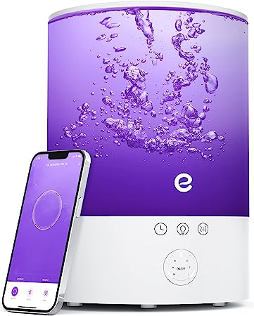

## How to reverse engineer the Tuya settings

To find out the entities needed to integrate the device in HomeAssistant, I used the **TuyaDebug** tool following [this guide](https://github.com/rospogrigio/localtuya/wiki/HOWTO-get-a-DPs-dump).

I used an [excel file](assets/Tuya-Umidifier-Switches.xlsx) to write down all the possible device configurations and then, in an iterative process, I tried to see how the results of TuyaDebug changed as the settings changed.  
  

In the end, with a little patience, this is the result:

```
Name: Power
Entity type: Switch
Datapoint ID: 1
```
-----
```
Name: Spray
Entity type: Switch
Datapoint ID: 2
```
-----
```
Name: Light
Entity type: Light
Datapoint ID: 5
```
-----
```
Name: Color
Entity type: Select
Datapoint ID: 6
Entries: 1;2;3;4;5;6;7;8;9
User Friendly Opions: Auto;White;Red;Orange;Yellow;Green;Cyan;Blue;Purple
```
-----
```
Name: Sleep
Entity type: Switch
Datapoint ID: 16
```
-----
```
Name: Timer
Entity type: Select
Datapoint ID: 19
Entries: cancel;2h;4h;8h
User Friendly Opions: Off;2h;4h;8h
```
-----
```
Name: Timer remaining time
Entity type: Sensor
Datapoint ID: 20
Device Class: duration
Unit of Measurement: Minutes
```
-----
```
Name: Water Empty
Entity type: Sensor
Datapoint ID: 22
Device Class: power
```
-----
```
Name: Power Level
Entity type: Select
Datapoint ID: 23
Entries: level_3;level_2;level_1
User Friendly Opions: Low;Medium;High
```

## How to setup the integration in LocalTuya

Now, once you have discovered the meaning of each datapoint, you can proceed to add the new device.

Open the **Settings** page, go to **Devices & Services**, search the **LocalTuya** integration and click on **Configure**

### Add the device
Select **Add a new device** and then select the device from the list ( 
Remeber, that you should assing a static ip address to the device).

Proceed with the settings as follows.  
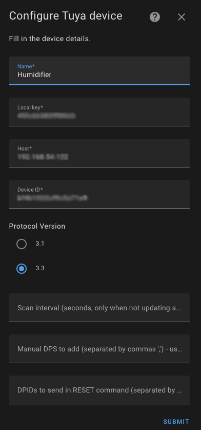

### Add the datapoints
Ater adding the device, you will be prompted to *"Please pick the type of entity you want to add."* for every datapoint to configure.  

Be careful to enter the correct type of platform and then fill in the various fields according to the images shown.

#### Power
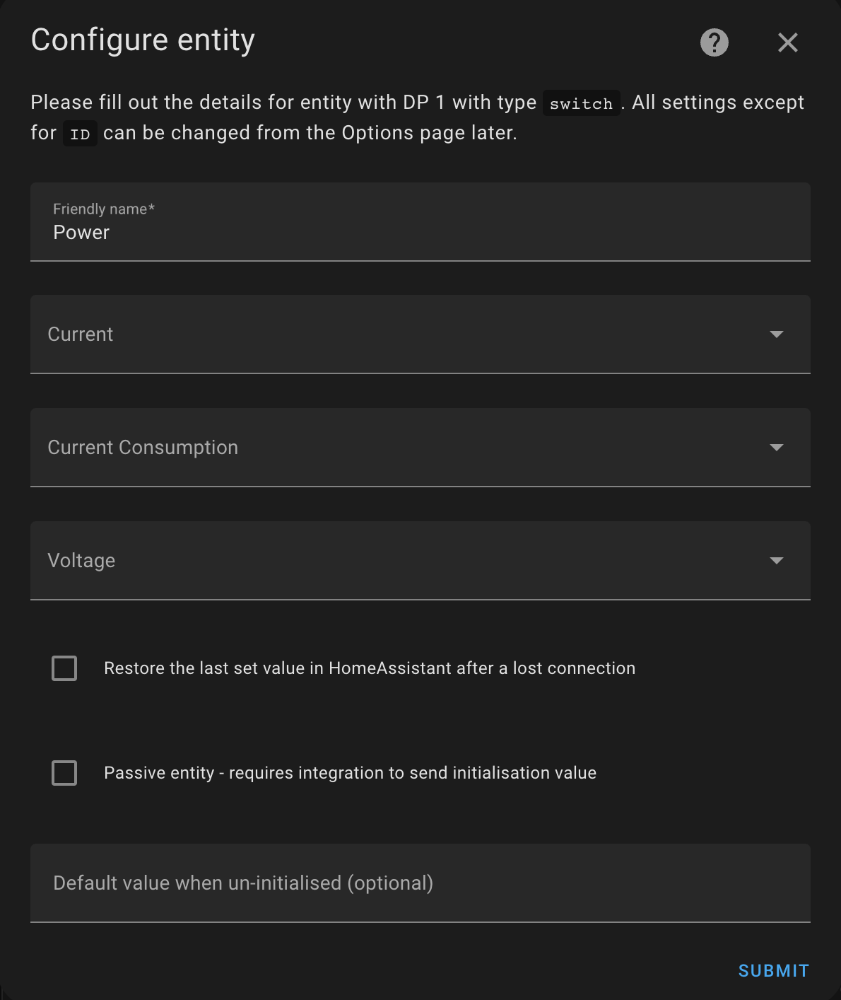  

#### Spray
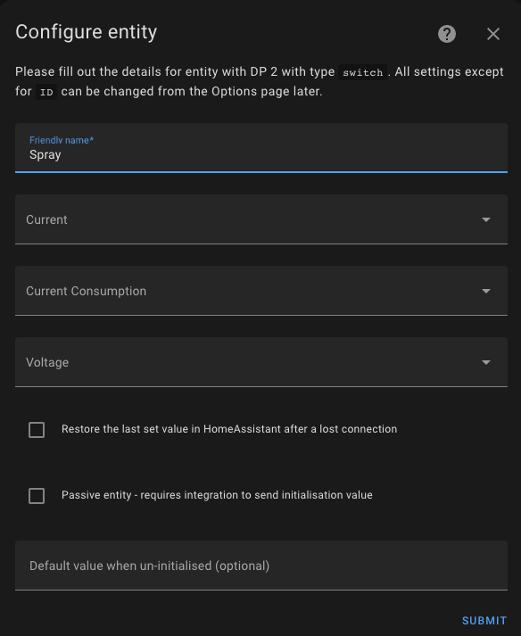  

#### Light
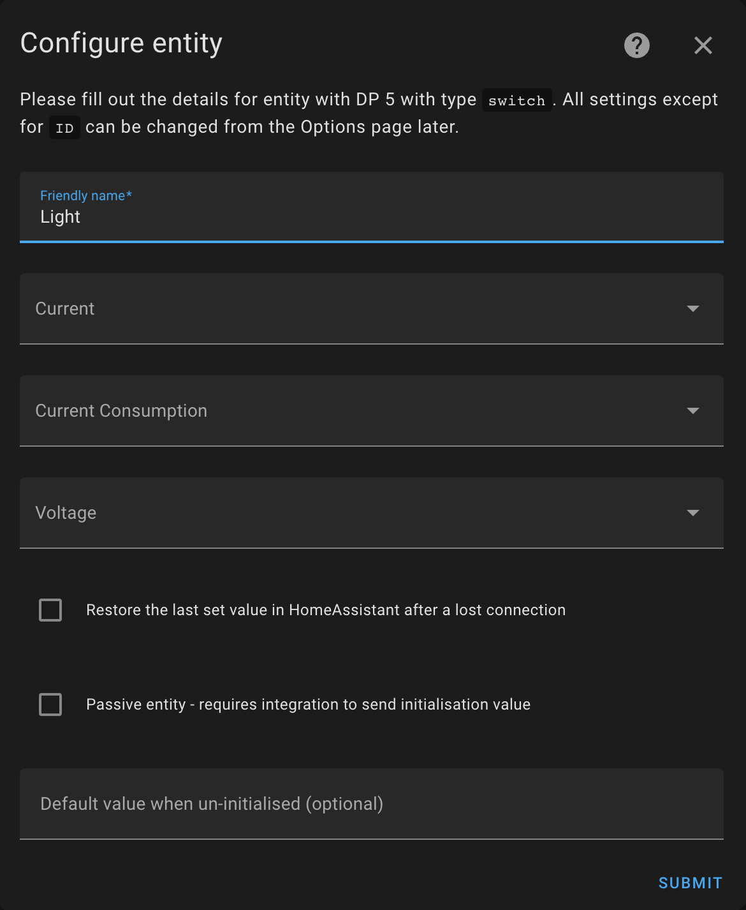

#### Color
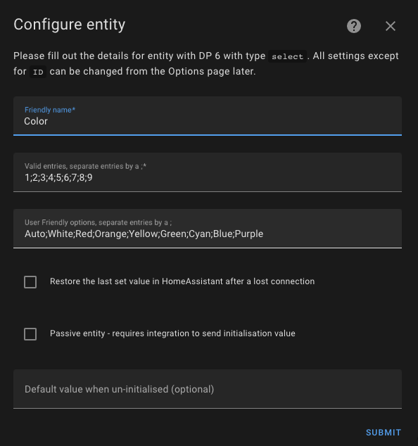

#### Sleep
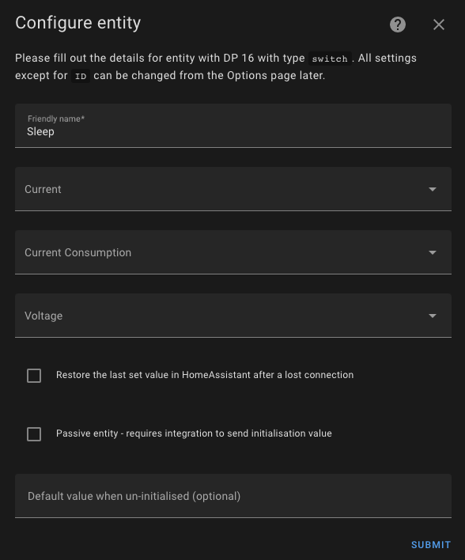

#### Timer
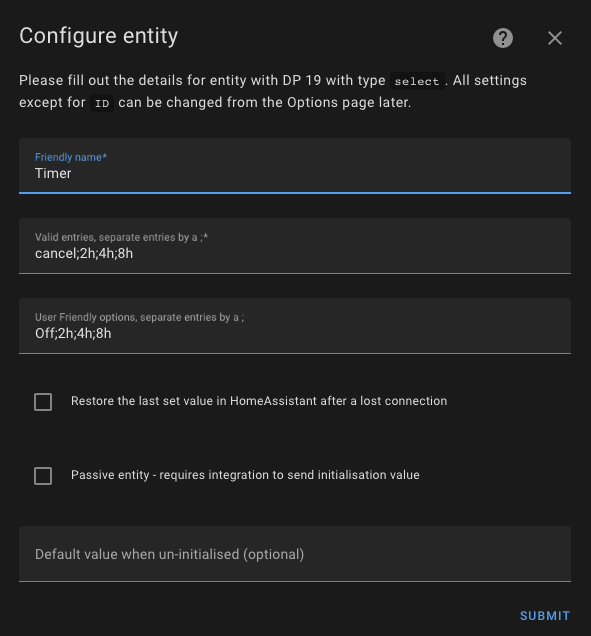

#### Timer Remaining Time
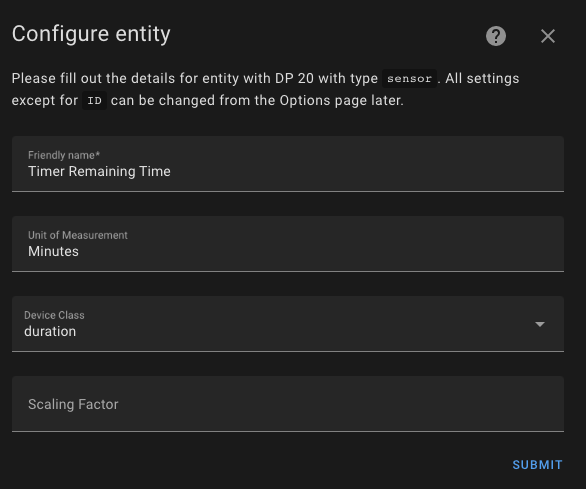

#### Water Empty
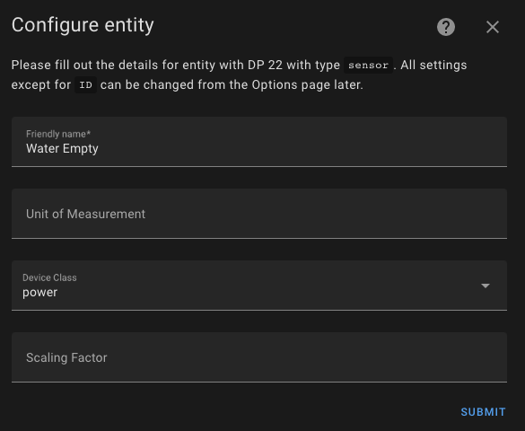

#### Power Level
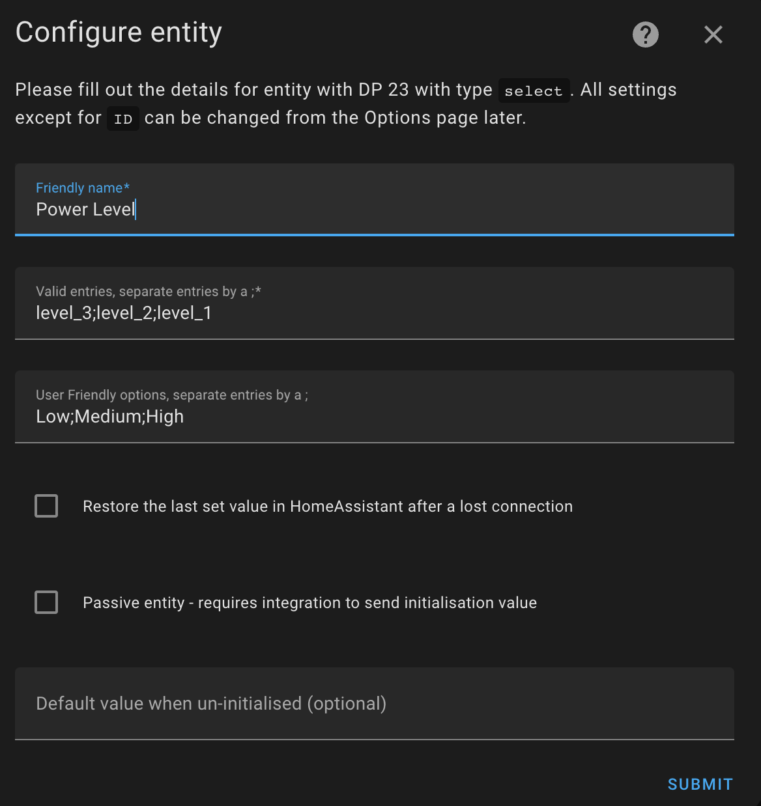

